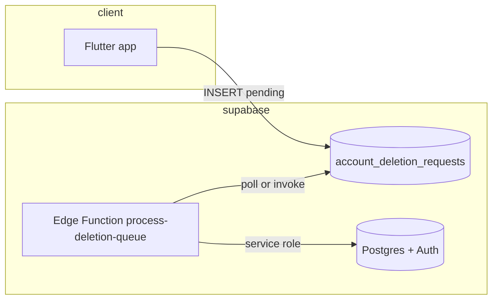

# Edge Function — full account deletion (recommended design)

This document describes a **future** production pipeline that **consumes** rows in `public.account_deletion_requests` and performs real deletion/anonymization using the **Supabase service role** (never from the Flutter client).

The app today only **creates** rows with `status = 'pending'`. This function (or a secure cron job) would **move** them through `processing` → `completed` (or mark errors).

---

## Goals

1. **Validate** work items (only process legitimate `pending` rows).
2. **Delete or anonymize** user-generated data in a **safe FK order**.
3. **Delete the Auth user** via Admin API when data is cleaned up.
4. **Idempotent** runs — safe to retry a failed row.
5. **No secrets in the client** — `SUPABASE_SERVICE_ROLE_KEY` only in Edge Function secrets / vault.

---

## High-level architecture



**Triggers (choose one):**

| Option | Pros | Cons |
|--------|------|------|
| **Scheduled cron** (e.g. every 15 min) | Simple, no client invoke | Latency |
| **Database webhook** on `INSERT` | Near real-time | More wiring |
| **Manual HTTP invoke** from CI | Ops control | Not automatic |

---

## Suggested function layout

**Name:** `process-account-deletions` (or `account-deletion-worker`)

**Runtime:** Deno (Supabase Edge Functions default)

**Secrets (env):**

- `SUPABASE_URL` — project URL  
- `SUPABASE_SERVICE_ROLE_KEY` — **server only**  
- Optional: `INTERNAL_CRON_SECRET` — if exposing HTTP, require `Authorization: Bearer <secret>` from cron or Supabase scheduler

**Flow:**

1. Create Supabase client with **service role**.
2. `SELECT` from `account_deletion_requests`  
   `WHERE status = 'pending' ORDER BY created_at ASC LIMIT N`  
   `FOR UPDATE SKIP LOCKED` (if using raw SQL via RPC) or optimistic `UPDATE ... WHERE status = 'pending';` to claim rows.
3. For each claimed row, set `status = 'processing'` (and optionally `started_at` if you add column).
4. Run **data deletion** for `user_id` (see order below).
5. Call `auth.admin.deleteUser(user_id)` (or REST Admin API).
6. Set `status = 'completed'`, set `completed_at` (recommended column).
7. On failure: log; set `status = 'pending'` or new `failed` with `last_error` (recommended columns); alert ops.

---

## Recommended schema additions (future migration)

| Column | Type | Purpose |
|--------|------|---------|
| `started_at` | `timestamptz` | When worker picked row |
| `completed_at` | `timestamptz` | When fully done |
| `last_error` | `text` | Last failure message |
| `attempt_count` | `int` | Retries |

RLS does not apply to service role; restrict who can **read** these columns in production (dashboard only).

---

## Deletion / anonymization order (conceptual)

Order depends on your FK graph. **Typical** order (adjust to your migrations):

1. **Storage** — remove objects under `user_id` paths (avatars, posts media).
2. **Child tables** — e.g. `messages`, `posts`, `swipes`, `matches`, `chat_members`, `game_participants`, `reports`, `blocked_users` (both directions), etc.
3. **`profiles`** (or anonymize row if you must retain a stub).
4. **Chats** — delete or orphan per product rules (e.g. delete 1:1 chats only; game chats may need soft rules).
5. **`auth.users`** — `deleteUser` last.

Use **transactions** where possible; for cross-API calls (Auth + DB), use **compensating actions** or mark **processing** until Auth delete succeeds.

---

## Idempotency

- If `deleteUser` fails after DB cleanup, row may remain in a half-done state. Store **step** or use **completed** only when Auth delete returns 200.
- Re-running a `completed` row should be a no-op.

---

## Security checklist

- [ ] Function never logs service role key.  
- [ ] HTTP endpoint (if any) requires **secret header** or **Supabase JWT** with **service role only** from trusted callers — **not** the anon key from the app.  
- [ ] Rate-limit invocations.  
- [ ] Prefer **internal cron** + no public URL for the worker.

---

## TypeScript sketch (pseudo-code)

```ts
import { createClient } from "https://esm.sh/@supabase/supabase-js@2";

Deno.serve(async (req) => {
  // Optional: verify cron secret
  const authHeader = req.headers.get("Authorization");
  if (authHeader !== `Bearer ${Deno.env.get("INTERNAL_CRON_SECRET")}`) {
    return new Response("Unauthorized", { status: 401 });
  }

  const supabase = createClient(
    Deno.env.get("SUPABASE_URL")!,
    Deno.env.get("SUPABASE_SERVICE_ROLE_KEY")!,
    { auth: { persistSession: false } }
  );

  const { data: rows } = await supabase
    .from("account_deletion_requests")
    .select("id, user_id")
    .eq("status", "pending")
    .order("created_at", { ascending: true })
    .limit(10);

  for (const row of rows ?? []) {
    await supabase
      .from("account_deletion_requests")
      .update({ status: "processing" })
      .eq("id", row.id);

    try {
      // await deleteUserData(supabase, row.user_id);
      // await supabase.auth.admin.deleteUser(row.user_id);
      await supabase
        .from("account_deletion_requests")
        .update({ status: "completed" })
        .eq("id", row.id);
    } catch (e) {
      console.error(e);
      await supabase
        .from("account_deletion_requests")
        .update({ status: "pending", last_error: String(e) })
        .eq("id", row.id);
    }
  }

  return new Response(JSON.stringify({ ok: true }), {
    headers: { "Content-Type": "application/json" },
  });
});
```

Implement `deleteUserData` with your real table names and FK-safe order.

---

## Relation to the Flutter app

| Step | App (today) | Edge Function (future) |
|------|----------------|-------------------------|
| User intent | Insert `pending` + show reference | — |
| Data wipe | — | Service role deletes |
| Auth user | Sign out only | `auth.admin.deleteUser` |
| `status` | Stays `pending` until worker | `processing` → `completed` |

---

## References

- [Supabase Edge Functions](https://supabase.com/docs/guides/functions)  
- [Auth Admin API](https://supabase.com/docs/reference/javascript/auth-admin-deleteuser)
